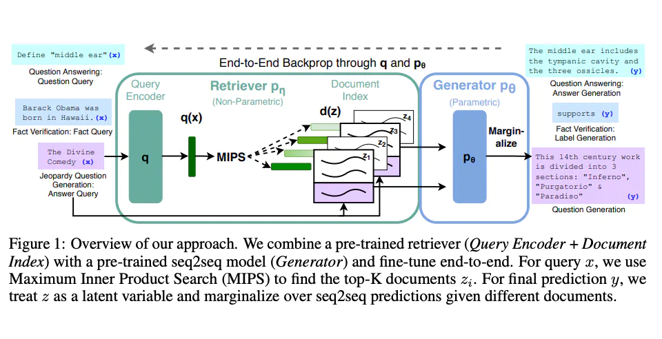

# RAG(检索增强生成（Retrieval-augmented generation)

通用语言模型通过微调就可以完成几类常见任务，比如分析情绪和识别命名实体。这些任务不需要额外的背景知识就可以完成。

要完成更复杂和知识密集型的任务，可以基于语言模型构建一个系统，访问外部知识源来做到。这样的实现与事实更加一性，生成的答案更可靠，还有助于缓解“幻觉”问题。

Meta AI 的研究人员引入了一种叫做检索增强生成（Retrieval Augmented Generation，RAG）(opens in a new tab)的方法来完成这类知识密集型的任务。RAG 把一个信息检索组件和文本生成模型结合在一起。RAG 可以微调，其内部知识的修改方式很高效，不需要对整个模型进行重新训练。

RAG 会接受输入并检索出一组相关/支撑的文档，并给出文档的来源（例如维基百科）。这些文档作为上下文和输入的原始提示词组合，送给文本生成器得到最终的输出。这样 RAG 更加适应事实会随时间变化的情况。这非常有用，因为 LLM 的参数化知识是静态的。RAG 让语言模型不用重新训练就能够获取最新的信息，基于检索生成产生可靠的输出。

Lewis 等人（2021）提出一个通用的 RAG 微调方法。这种方法使用预训练的 seq2seq 作为参数记忆，用维基百科的密集向量索引作为非参数记忆（使通过神经网络预训练的检索器访问）。这种方法工作原理概况如下：

