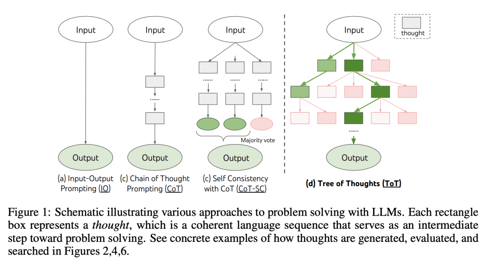

# 思维树（ToT）

该框架基于思维链提示进行了总结，引导语言模型探索把思维作为中间步骤来解决通用问题。
ToT 维护着一棵思维树，思维由连贯的语言序列表示，这个序列就是解决问题的中间步骤。使用这种方法，LM 能够自己对严谨推理过程的中间思维进行评估。LM 将生成及评估思维的能力与搜索算法（如广度优先搜索和深度优先搜索）相结合，在系统性探索思维的时候可以向前验证和回溯。

「思维树」可以让LLM：

- 自己给出多条不同的推理路径
- 分别进行评估后，决定下一步的行动方案
- 在必要时向前或向后追溯，以便实现进行全局的决策

## 要点:
**动机**：解决语言模型在问题求解中的局限性，特别是对于需要探索、策略先见性或初始决策起关键作用的任务。为克服这些挑战，引入一种新的语言模型推理框架"Tree of Thoughts"(ToT)，通过提供具有连贯性的文本单元("thoughts")的探索，使语言模型能够进行有意识的决策过程，考虑多个不同的推理路径并自我评估选择以决定下一步行动。

**方法**：提出"Tree of Thoughts"(ToT)框架，通过维护一棵思维树，每个思维是一条连贯的语言序列，作为问题求解的中间步骤，实现语言模型的有意识推理过程。通过与搜索算法(如广度优先搜索或深度优先搜索)结合，允许系统性地探索思维树并进行前瞻和回溯。

**优势**：ToT框架显著提升了语言模型在需要复杂规划或搜索的任务中的问题求解能力。在Game of 24、Creative Writing和Mini Crosswords等任务中，ToT方法的成功率明显高于传统的prompting方法，例如在Game of 24中，使用ToT方法的成功率达到74%。ToT框架提供了一种直观的方式来观察模块，从而增强了模型的可解释性。

Tree of Thoughts"(ToT)框架为语言模型提供了有意识的决策过程，通过探索连贯的文本单元来解决问题，显著提升了语言模型在复杂任务中的问题解决能力。

**PS**:图片援引自：[Yao et el. (2023)](https://arxiv.org/abs/2305.10601)
